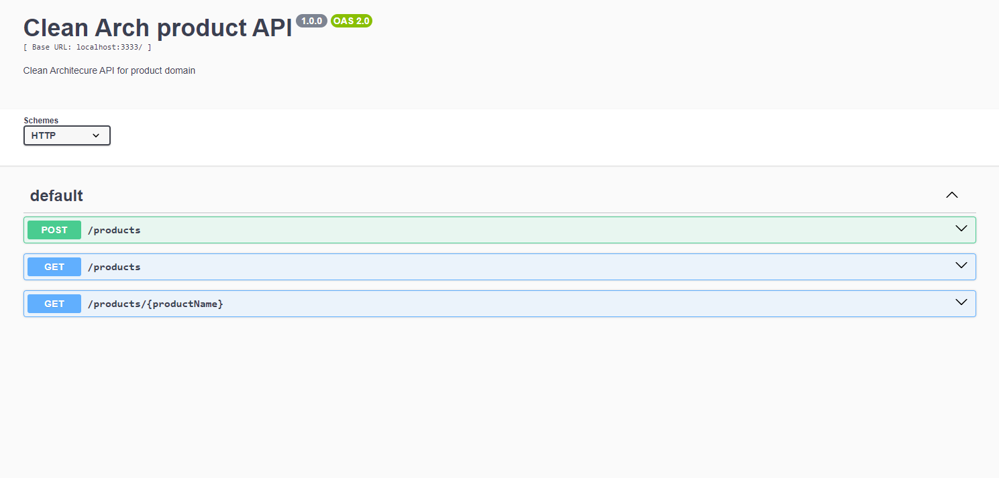

### Product API

###### Product API built for enforcing Clean Architecture

This API also was built for a micro-frontend client application, which runs above the Angular framework and single-spa

## Technologies

- NodeJS
- Express
- Typescript
- Swagger
- AWS CloudWatch Logs
- Docker
- Docker Compose
- LocalStack

 
## Running the project

First of all, make sure you have hit installed, clone this repository and go to the project's directory.

After, running the app it's quite simple, just follow the steps below:

#### Running with Docker

1. First, make sure your environment has Docker and Docker Compose available;
2. Build the project by running `npm run build`;
3. Run `docker-compose up --build` for creating the image and run the container;
4. Access the API documentation at `http://localhost:3333/api-docs`, have fun!

#### Running without Docker

1. First, make sure your environment has NodeJS installed;
2. Build the project by running `npm run build`;
3. Install project dependencies by running `npm install`;
4. Access the API documentation in `http://localhost:3333/api-docs`, have fun!

### Requirements for running this project

- [Git](https://git-scm.com/)
- [NodeJS](https://nodejs.org/)
- [Docker](https://www.docker.com/)
- [Docker Compose](https://www.docker.com/)

Made with ❤️ by Danilo
